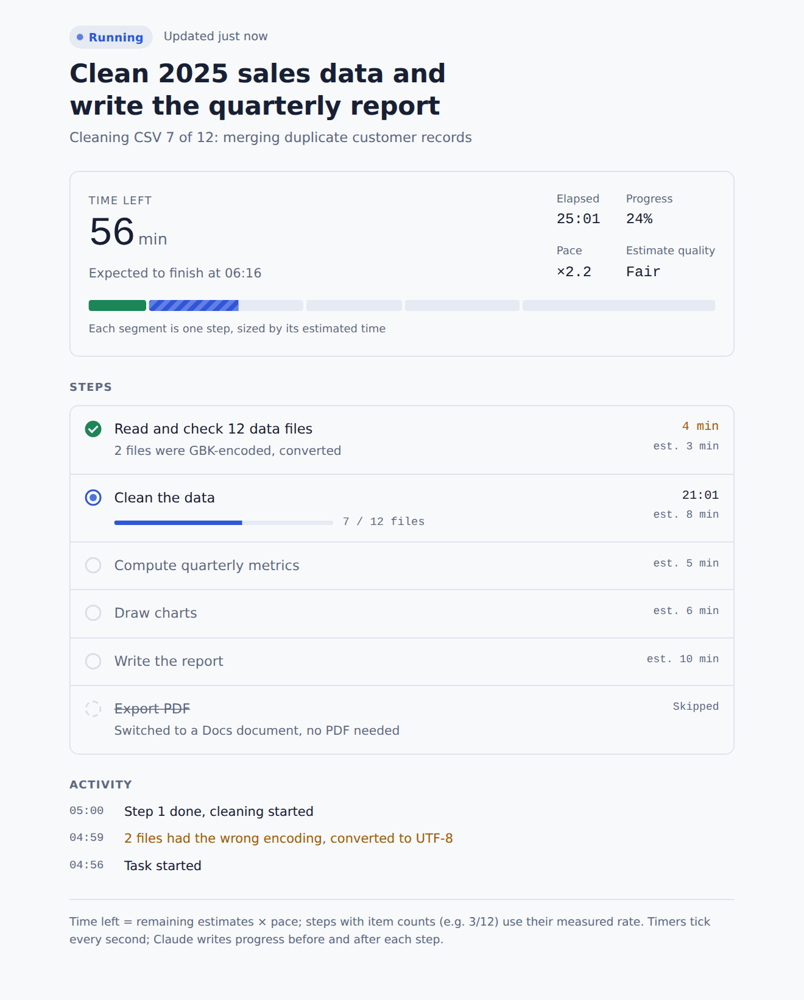
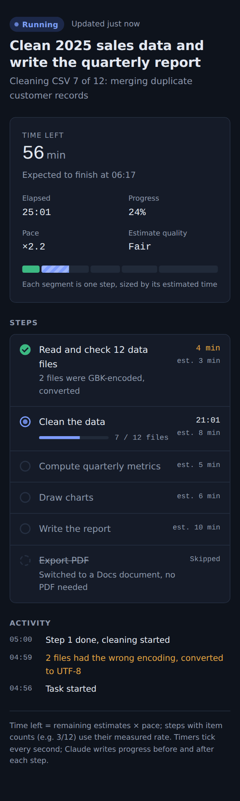

# Live Progress: a progress bar and ETA for Claude's long tasks

**English** | [简体中文](README.zh-CN.md)

  

When Claude works on a long task (research, batch file processing, a multi-section report), you usually can't tell how far along it is or how long it will take. **live-progress** is an [Agent Skill](https://github.com/anthropics/skills) that fixes that. At the start of a long task, Claude publishes a live progress page as an artifact. You can open it at any time to see:

- what Claude is doing right now
- every step, with its status and time taken
- a segmented progress bar, where each segment is sized by that step's estimated time
- time elapsed, **time left, and the expected finish time**
- a short activity log

**[▶ Try the live demo](https://bhu0345.github.io/claude-live-progress-skill/#en)** (simulated data, updates every few seconds)

<p>
  
  
</p>

## How it works

```
Claude ──ArtifactData.update──▶ artifact database (run/state) ──live subscription──▶ progress page
        (once per checkpoint)                                                        (ticks every second)
```

- The page never writes anything. It subscribes to one document, `run/state`, in the artifact's database.
- Claude writes a small merge update at each checkpoint, usually when one step ends and the next begins. Only the changed fields are sent.
- The page does all the timing and ETA work itself, every second, from the timestamps Claude wrote.

### How the ETA is estimated

1. Claude gives every step an estimate in minutes (`est`) when it plans the task.
2. The page learns a **pace** factor from real timings: actual time of finished steps ÷ their estimates. It also counts evidence from the running step, and uses a prior so one early outlier doesn't make the ETA swing.
3. Time left = what remains of the running step + remaining estimates × pace.
4. If a step processes many items (for example 7 / 12 files), its remaining time comes from the measured rate per item.
5. If no update arrives for a while, the page says so. That usually means a long step is running, or the task stopped.

## Install

### Claude app (claude.ai / desktop)

1. Download [`dist/live-progress.zip`](dist/live-progress.zip).
2. Go to **Customize → Skills → Add** and upload the zip. Code execution must be enabled.
3. Start any long task. You can also ask for it directly: *"use live-progress to show progress"*.

The progress page uses the artifact **database** capability (`ArtifactData`), so it needs a Claude environment with artifacts that support runtime capabilities.

### Claude Code

```bash
git clone https://github.com/bhu0345/claude-live-progress-skill
cp -r claude-live-progress-skill/live-progress ~/.claude/skills/
```

Terminal Claude Code has no artifacts. There, the skill tells Claude to fall back to its built-in task list.

## What's in the repo

| Path | What it is |
|---|---|
| [`live-progress/SKILL.md`](live-progress/SKILL.md) | The skill: when to use it, the data protocol, how often to update, and the page template, all embedded in one file |
| [`dist/live-progress.zip`](dist/live-progress.zip) | The same skill, packaged for upload to the Claude app |
| [`docs/index.html`](docs/index.html) | A standalone demo of the page with a fake runtime (served on GitHub Pages) |

The template is embedded at the end of `SKILL.md`. When the skill runs, Claude extracts it with one command, so it doesn't have to rewrite about 25 KB of HTML for every task.

## Data format

One document at `run/state`:

```json
{
  "title": "Clean 2025 sales data and write the quarterly report",
  "lang": "en",
  "status": "running",
  "startedAt": 1790300000,
  "updatedAt": 1790300240,
  "activity": "Cleaning CSV 7 of 12",
  "steps": {
    "s01": {"n": 1, "title": "Read the data files", "est": 3, "status": "done", "startedAt": 1790300000, "endedAt": 1790300240},
    "s02": {"n": 2, "title": "Clean the data", "est": 8, "status": "running", "startedAt": 1790300240, "done": 7, "total": 12, "unit": "files"}
  },
  "log": {"1790300240": "Files read, cleaning started"}
}
```

`status` is one of `running`, `waiting` (Claude is waiting for your reply), `done` or `failed`. Each step is `pending`, `running`, `done`, `failed` or `skipped`. Timestamps are Unix seconds; the page also accepts milliseconds and ISO strings. The full reference is in [`SKILL.md`](live-progress/SKILL.md).

## Cost and trade-offs

- Each checkpoint costs Claude one or two extra tool calls, so the skill is meant for tasks longer than about 5 minutes or with 5 or more steps.
- Before any step finishes, the ETA rests only on Claude's own estimates, and the page labels it *Rough*. It gets better once real timings arrive.
- If your app asks you to approve each database write, choose *always allow*. Otherwise an unattended task will pause at the first update.

## Contributing

Issues and PRs are welcome, especially for better estimation heuristics, more languages in the page, and screenshots from real runs.

If this skill helps you, a ⭐ helps other people find it.

## License

[MIT](LICENSE)
