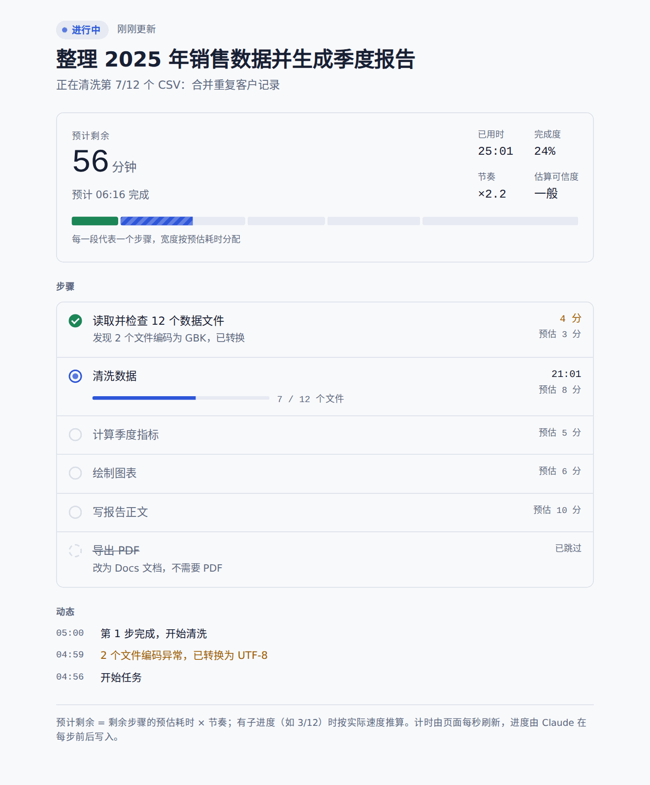
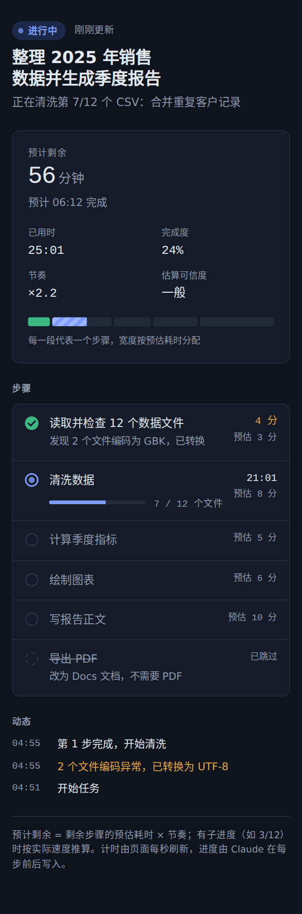

# Live Progress：给 Claude 长任务加上进度条和预计完成时间

[English](README.md) | **简体中文**

  

Claude 做长任务时（调研、批量处理文件、写多章节报告），你通常看不出它做到哪了、还要多久。**live-progress** 是一个 [Agent Skill](https://github.com/anthropics/skills)，用来解决这个问题。长任务一开始，Claude 会发布一个实时进度页（artifact），你随时点开就能看到：

- Claude 现在在做什么
- 每一步的状态和用时
- 分段进度条，每一段的宽度按该步骤的预估耗时分配
- 已用时、**预计剩余时间和预计几点完成**
- 关键节点的动态记录

**[▶ 在线演示](https://bhu0345.github.io/claude-live-progress-skill/)**（模拟数据，每隔几秒自动推进）

<p>
  
  
</p>

## 原理

```
Claude ──ArtifactData.update──▶ artifact 数据库 (run/state) ──实时订阅──▶ 进度页
         （每个检查点写一次）                                              （每秒刷新计时）
```

- 页面本身不写任何数据，只订阅 artifact 数据库里的一个文档 `run/state`。
- Claude 在检查点写一次合并更新，通常是一步结束、下一步开始的时候，只发送有变化的字段。
- 计时和预计剩余时间都由页面根据 Claude 写入的时间戳，每秒自己计算。

### 预计时间怎么算

1. Claude 规划任务时，给每一步写一个预估分钟数（`est`）。
2. 页面用实际耗时学出一个**节奏**系数：已完成步骤的实际耗时 ÷ 预估耗时。进行中的步骤也算作证据，另外加了先验，所以前面某一步偏差很大时，预计时间不会大起大落。
3. 预计剩余 = 进行中步骤还剩的时间 + 剩余步骤的预估 × 节奏。
4. 某一步要处理很多项目时（比如 7 / 12 个文件），按每一项的实际处理速度推算这一步还要多久。
5. 太久没有收到更新时，页面会提示。这通常是在执行较长的一步，也可能是任务已停止。

## 安装

### Claude 应用（网页版 / 桌面版）

1. 下载 [`dist/live-progress.zip`](dist/live-progress.zip)。
2. 打开 **Customize → Skills → Add**，上传这个 zip。需要先开启代码执行。
3. 开始一个长任务即可。也可以直接说："用 live-progress 显示进度"。

进度页用到 artifact 的**数据库**能力（`ArtifactData`），需要在支持该能力的 Claude 环境里使用。

### Claude Code

```bash
git clone https://github.com/bhu0345/claude-live-progress-skill
cp -r claude-live-progress-skill/live-progress ~/.claude/skills/
```

终端里的 Claude Code 没有 artifact。在那里，skill 会让 Claude 改用自带的任务列表显示步骤。

## 仓库内容

| 路径 | 说明 |
|---|---|
| [`live-progress/SKILL.md`](live-progress/SKILL.md) | skill 本体：触发条件、数据协议、更新节奏，以及页面模板，全部在一个文件里 |
| [`dist/live-progress.zip`](dist/live-progress.zip) | 同一个 skill，打包好用于上传到 Claude 应用 |
| [`docs/index.html`](docs/index.html) | 可以独立打开的演示页，用模拟数据代替 Claude 运行时（部署在 GitHub Pages） |

页面模板放在 `SKILL.md` 末尾。skill 运行时，Claude 用一条命令把它提取出来，不用每个任务都重写约 25 KB 的 HTML。

## 数据格式

只有一个文档 `run/state`：

```json
{
  "title": "整理 2025 年销售数据并生成季度报告",
  "lang": "zh",
  "status": "running",
  "startedAt": 1790300000,
  "updatedAt": 1790300240,
  "activity": "正在清洗第 7/12 个 CSV",
  "steps": {
    "s01": {"n": 1, "title": "读取数据文件", "est": 3, "status": "done", "startedAt": 1790300000, "endedAt": 1790300240},
    "s02": {"n": 2, "title": "清洗数据", "est": 8, "status": "running", "startedAt": 1790300240, "done": 7, "total": 12, "unit": "个文件"}
  },
  "log": {"1790300240": "数据读取完成，开始清洗"}
}
```

`status` 可取 `running`、`waiting`（等你回复）、`done`、`failed`。每一步的状态可取 `pending`、`running`、`done`、`failed`、`skipped`。时间戳用 Unix 秒，页面也接受毫秒和 ISO 字符串。完整字段说明见 [`SKILL.md`](live-progress/SKILL.md)。

## 代价和局限

- 每个检查点要多 1 到 2 次工具调用，所以只建议用在超过约 5 分钟、或有 5 个以上步骤的任务上。
- 还没有步骤完成时，预计时间只能依据 Claude 自己的估算，页面会标为"粗略"。有了实际耗时后会越来越准。
- 如果应用要求你批准每次数据写入，请选"始终允许"。否则你不在的时候，任务会停在第一次更新那里。

## 参与贡献

欢迎提 Issue 和 PR，特别是这几方面：更好的时间估算方法、页面的更多语言、真实任务的截图。

如果这个 skill 对你有用，点个 ⭐ 能让更多人看到它。

## 许可证

[MIT](LICENSE)
